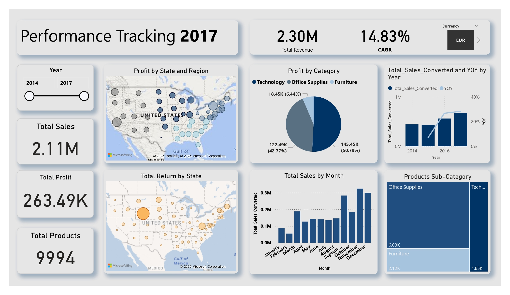

# Sales_analysis
# 📊 Business Intelligence Dashboard – Power BI

  
*Above: Interactive Power BI Dashboard showing KPIs, trends, and insights.*

---

## ✨ Project Overview
This project is an **interactive Business Intelligence Dashboard** built in **Power BI** to analyze sales, profit, and product performance. It provides an in-depth view of business trends with advanced filtering and dynamic metrics.

---

## 📌 Key Features

### 1️⃣ Key Performance Indicators (KPIs) for 2017
- **Total Sales**
- **Total Number of Products**
- **Total Profit**

### 2️⃣ Dynamic CAGR Calculation
- Automatically updates based on **user-selected start and end years**.

### 3️⃣ Sales & Year-over-Year Growth Analysis
- Visual representation of **sales trends** and **annual growth rates**.

### 4️⃣ Regional Segmentation with US Map
- Breakdown by **Country, Region, State, and City**.
- Classification of regions into **High**, **Medium**, and **Low Profit Zones**.

### 5️⃣ Treemap Visualization
- Combined chart for **Category** and **Sub-category distribution**.

### 6️⃣ Best Month for Sales
- Visualization of the **highest-performing month** based on sales data.

### 7️⃣ Return Rate Analysis
- Percentage of orders returned by **Region** and **Product**.

---

## 🎯 Filters & Interactivity
- **Currency Conversion Master Filter**: Dollar, Euro, Pound, Rupee.
- Regional and category filters for detailed analysis.
- Additional insights derived from **data trends** for better decision-making.

---

## 📷 Dashboard Preview
> Replace `dashboard.png` with the actual screenshot file name in your repo.

---

## 🛠 Tools & Technologies Used
- **Power BI**
- **Data Modeling**
- **DAX Measures**
- **Data Cleaning & Transformation**
- **Advanced Visualization Techniques**

---

## 📬 Contact
**Mayank Maiti**  
📧 [mayankmaiti03@gmail.com](mailto:mayankmaiti03@gmail.com)  
🔗 [LinkedIn](https://www.linkedin.com/in/mayank-maiti/) | [GitHub](https://github.com/mayankmaiti03)  

---
⭐ *If you found this project helpful, please consider giving it a star on GitHub!*
